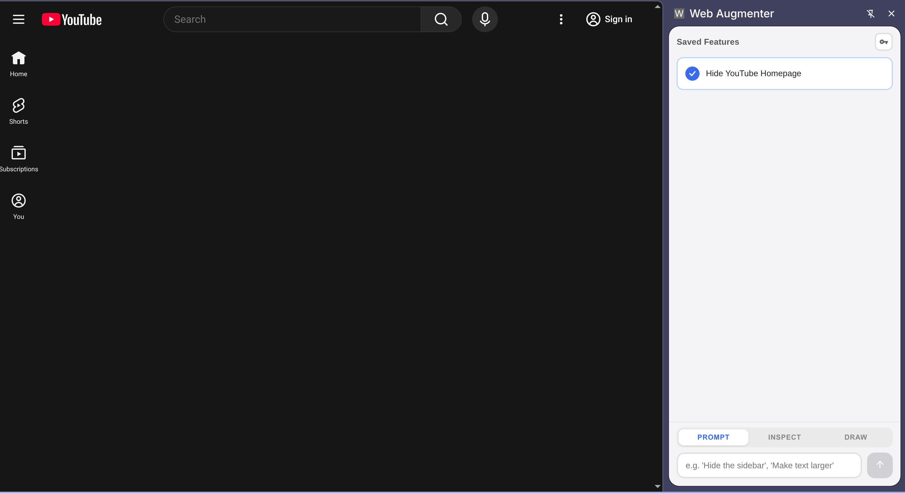

# Web Augmenter

**Turn any website into a programmable surface using natural language.**

Web Augmenter is a Chrome side panel extension that lets you modify any website by describing what you want in plain English. It uses AI to generate and inject CSS/JavaScript changes on the fly.

[Landing Page](https://harishsg993010.github.io/web-augmenter/) · [Demo](https://youtu.be/fowkw8RCs-M)




## Features

- **Prompt mode**: Describe a change and apply it to the current page
- **Inspect mode**: Click any element on the page to select it, then describe what to change
- **Draw mode**: Draw a rectangle on the page to define a region, then describe the UI to generate there
- **Saved features**: Applied changes are saved and auto-applied on return visits
- **Multiple AI providers**: Anthropic (Claude) or OpenRouter with a configurable model

## Installation

1. Clone or download this repository
2. Build the extension:
   ```bash
   npm install
   npm run build
   ```
3. Load in Chrome:
   - Go to `chrome://extensions/`
   - Enable **Developer mode**
   - Click **Load unpacked** and select the `dist` folder
4. After loading, click **Details** on the extension and enable **Allow user scripts**

## Usage

Open the side panel by clicking the Web Augmenter icon in the Chrome toolbar.

### Modes

| Mode | How to activate | What it does |
|------|----------------|--------------|
| **Prompt** | Default | Type an instruction and apply it to the whole page |
| **Inspect** | Click **INSPECT** tab | Click an element on the page, then describe the change |
| **Draw** | Click **DRAW** tab | Draw a rectangle on the page, then describe the UI to create |

### API Setup

Click the key icon in the top-right of the panel to configure your AI provider.

**Anthropic**: paste an API key starting with `sk-ant-...`

**OpenRouter**: paste your OpenRouter key and optionally specify a model (defaults to `anthropic/claude-sonnet-4`).

### Saved Features

Every successfully applied instruction is saved as a feature. From the features list you can:
- Toggle auto-apply on/off per feature
- Delete a feature (also reloads the page)

Features are scoped to the site they were created on and auto-apply when you revisit.

## Development

```bash
npm install        # install dependencies
npm run build      # production build
npm run dev        # watch mode
npm run package    # zip for distribution
```

### Project Structure

```
src/
├── background/serviceWorker.ts   # service worker
├── content/
│   ├── contentScript.ts          # page interaction, mode handling
│   ├── injectPatches.ts          # CSS/JS injection
│   └── toolExecutor.ts           # AI tool execution
├── popup/
│   ├── popup.html / popup.ts     # side panel UI
│   └── popup.css
└── shared/
    ├── llmClient.ts              # Anthropic + OpenRouter API
    ├── domSnapshot.ts            # page structure extraction
    ├── screenshot.ts             # optional visual context
    ├── persistence.ts            # chrome.storage wrapper
    ├── types.ts
    └── constants.ts
```

### Permissions

- `activeTab`, `tabs` — access current tab and capture screenshots
- `scripting`, `userScripts` — inject generated CSS/JS
- `storage` — persist features and settings locally
- `sidePanel` — host the UI as a Chrome side panel
- `<all_urls>` — run on any website

## Privacy

All features and settings are stored locally in your browser (`chrome.storage.local`). The extension only sends page structure and your instruction to the configured AI API — no personal data is collected or stored externally.

## Contributors

- [Harish Santhanalakshmi Ganesan](https://www.linkedin.com/in/harish-santhanalakshmi-ganesan-31ba96171/)
- [Akilan Amithasagaran](https://www.linkedin.com/in/akilan-amithasagaran-315aa37a/)
